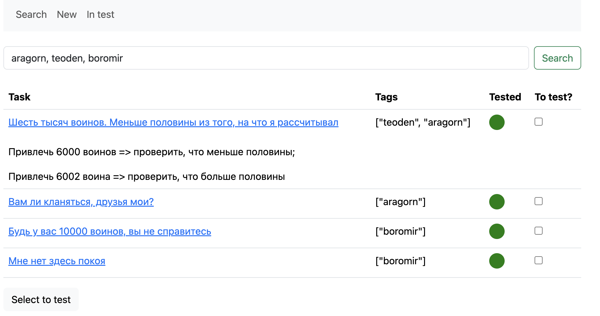
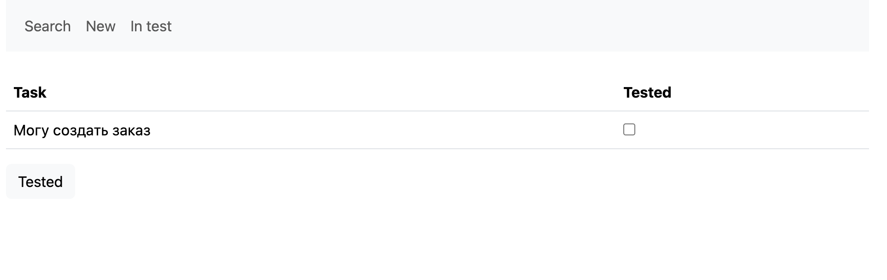
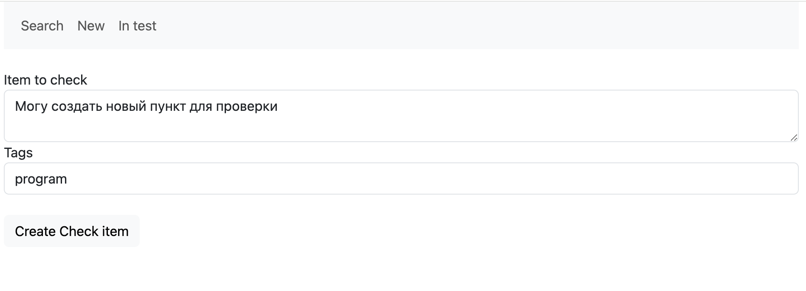

Собрать и запустить
```shell
docker build -t mindmap .
docker-compose up -d
docker exec -it mindmap /bin/bash
rake db:migrate
```


Сейчас реализация такая:

Есть сущность CheckItem. В ней описана проверка и есть булево поле to_test

Есть сущность Tag.

Они связаны через третью таблицу. У одного CheckItem может быть несколько Tag

На странице Search можно выполнять поиск по тегу/ам (например "order" или "order product"). Разделители " " или ","
Результат выведется в таблицу, с кликабельными ссылками, открывающими описание кейса



Выходит таблица с CheckItem с возможностью отметить нужные для теста
Если у CheckItem параметр to_test = true, то цветовое обозначение в столбце Tested красное, если  false, - зелёное

CheckItem с параметром to_test = true отображаются на странице "In test". Там есть возможность отметить проверенные и проставить флаг Tested



На странице New можно создавать новые проверки

